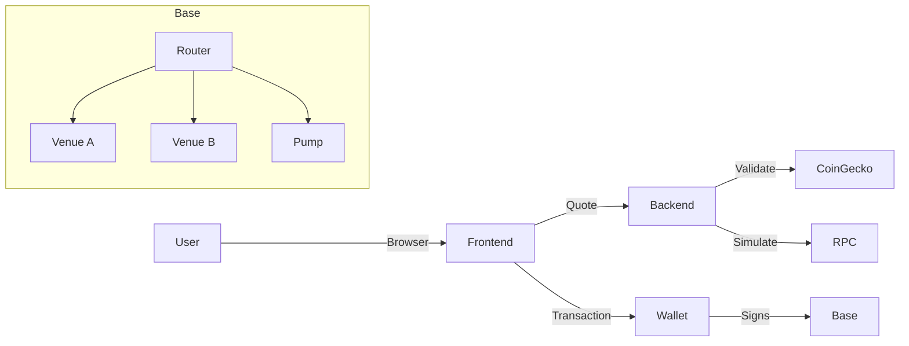
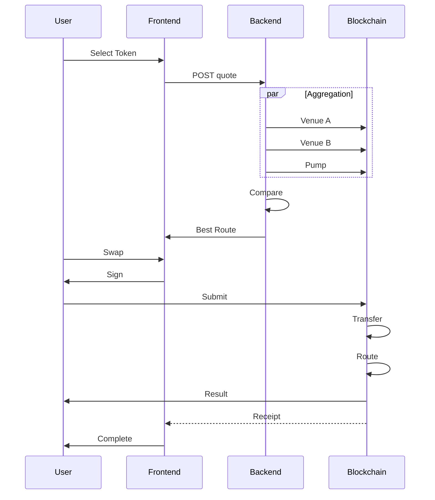

# System Architecture: BaseFlow Router

## Overview

The **BaseFlow Router** is a decentralized application (dApp) designed to aggregate liquidity across multiple decentralized exchanges (DEXs) on the Base network. Its primary goal is to provide traders with the optimal execution price for any given token swap by automatically comparing rates between traditional Automated Market Makers (AMMs) and the **RobinPump.fun** bonding curve.

The system bridges the gap between standard ERC-20 token trading and the unique pricing mechanics of bonding curves, offering a unified interface that abstracts the complexity of routing and price comparison. It is currently deployed on the Base Sepolia testnet, with architectural readiness for Base Mainnet.

## Key Requirements

### Functional Requirements

- **Smart Routing**: The system must querying multiple venues (Venue A, Venue B, RobinPump.fun) and execute trades via the most profitable route.
- **Bonding Curve Integration**: Specific support for the RobinPump.fun pricing model (linear/step function) is required.
- **Real-time Quoting**: Users must receive accurate, up-to-the-second price quotes.
- **Slippage Protection**: Trades must revert if the executed price falls below the user's specified slippage tolerance.

### Non-Functional Requirements

- **Latency**: Quote generation should take less than 2 seconds to ensure price validity.
- **Reliability**: The system must handle RPC failures gracefully (e.g., retries, circuit breakers).
- **Security**: Smart contracts must be non-custodial; user funds should only be approved for the specific swap transaction.
- **Usability**: The frontend must abstract the underlying complexity, presenting a simple "Swap" interface.

## High-Level Architecture

The architecture follows a standard dApp pattern with a "Smart Backend" approach. While the frontend interacts with the blockchain, a backend service aggregates off-chain data and on-chain simulations to provide optimized routing parameters.

The **React Frontend** serves as the user interface. It delegates complex routing logic to the **Backend API**, which computes the optimal path. The backend returns a constructed transaction payload, which the frontend proposes to the **User's Wallet**. The wallet signs the transaction, sending it to the **Base Network**, where the **Router Contract** executes the swap atomically.

## Component Details

### 1. Web Client (Frontend)

- **Responsibilities**: User interface, wallet connection library (Web3), state management for quote/swap flow.
- **Technologies**: React, TypeScript, Vite, TailwindCSS, Ethers.js.
- **Key Data**: User address, selected token pair, input amount, current quote state.
- **Communication**: HTTP to Backend API; JSON-RPC to User Wallet (MetaMask).

### 2. Backend API Service

- **Responsibilities**:
  - Aggregating quotes from multiple on-chain venues.
  - Validating prices against external oracles (CoinGecko) to prevent bad execution.
  - Constructing calldata for the Router contract.
- **Technologies**: Node.js, Express, TypeScript.
- **Key Data**: Configuration for RPC endpoints, contract addresses, and API keys.
- **Communication**: HTTPS to Quote/Token APIs; JSON-RPC to Base Network.

### 3. Smart Contracts (On-Chain)

- **Responsibilities**:
  - **Router.sol**: Central entry point. Validates slippage, transfers user funds, and routes to specific venues.
  - **Venue Adapters**: Standardized interfaces for interacting with different DEX types (Uniswap-style vs. Bonding Curve).
- **Technologies**: Solidity, Hardhat.
- **Key Data**: Token balances (transient), allowance states.
- **Communication**: Internal transact calls to other contracts.

### 4. External Integrations

- **Base Network RPC**: Provides connection to the blockchain state.
- **CoinGecko API**: Used as a "soft oracle" to validate that on-chain prices are within a sanity threshold of global market prices.

## Data Flow: Quote & Swap Execution

The following sequence describes the core "Get Quote -> Execute Swap" flow.

1. **Quote Request**: User inputs swap details.
2. **Aggregation**: Backend simulates the trade against all known liquidity sources.
3. **Optimization**: Backend identifies the venue yielding the highest output.
4. **Transaction Construction**: Backend returns the exact calldata needed to execute this optimal path.
5. **Execution**: User signs and submits the transaction to the blockchain.

## Data Model

The system is largely stateless (REST), but relies on the following conceptual data structures:

- **QuoteRequest**: `{ chainId, tokenIn, tokenOut, amountIn, slippageBps }`
- **QuoteResponse**: `{ smartVenue, smartAmountOut, improvementBps, routerCalldata }`
- **PumpFunInfo** (Specialized): `{ bondingProgress, currentPrice, graduated, marketCap }` - Metadata specific to the RobinPump.fun venue.

## Infrastructure & Deployment

### Deployment

- **Frontend**: Static site hosting (e.g., Vercel, Netlify).
- **Backend**: Node.js runtime (e.g., Railway, Heroku, or AWS Lambda).
- **Smart Contracts**: Immutable deployment on Base Sepolia (Testnet) and Base Mainnet.

### Environments

- **Local/Dev**: Uses Hardhat local network or forked Mainnet state.
- **Testnet (Sepolia)**: Active environment for beta testing.
- **Mainnet**: Production environment with real value.

## Scalability & Reliability

- **Stateless Backend**: The API is stateless, allowing for horizontal scaling behind a load balancer if quote volume increases.
- **RPC Redundancy**: The system architecture supports multiple RPC providers to handle rate limits or downtime (Circuit Breaker pattern implemented in provider service).
- **On-Chain Atomicity**: Transaction execution is atomic; if a trade fails or slippage is exceeded, the entire state reverts, ensuring user funds are never "stuck" in the router.

## Security & Compliance

- **Non-Custodial**: The Router contract never holds user funds. It only possesses allowance to move funds during the specific transaction execution.
- **Slippage Protection**: Strictly enforced on-chain. Users define a minimum output amount (`amountOutMin`), and the transaction reverts if this is not met.
- **Price Validation**: The backend checks the quoted price against CoinGecko's off-chain price. If there is a significant deviation (>5%), the UI creates a warning to prevent users from executing bad trades due to low liquidity or manipulation.

## Observability

- **Logging**: The backend implements structured JSON logging for all quote requests and errors.
- **Transaction Tracking**: The frontend links directly to BaseScan for transaction verification.
- **Error Handling**: Detailed error codes are returned to the client to distinguish between "Insufficient Liquidity", "Slippage Error", and "Network Issues".

## Trade-offs & Decisions

- **Off-Chain Routing vs. On-Chain Routing**:
  - *Decision*: We chose **Off-Chain Routing** (computing the best path on the backend).
  - *Reason*: Gas optimization. Calculating the best route on-chain is expensive. By doing it off-chain, we simply tell the contract *which* route to take, saving the user gas fees.
- **Mock Mode**:
  - *Decision*: Implemented a robust "Mock Mode" that simulates bonding curves without needing real testnet ETH.
  - *Reason*: Drastically improves developer velocity and allows for easier UI/UX demos without wallet friction.

## Future Improvements

- **Multi-Hop Routing**: Currently, the router executes single-hop swaps (A -> B). Future versions will support multi-hop (A -> C -> B) to find better prices through intermediate tokens.
- **MEV Protection**: Integration with private RPCs (like Flashbots) to protect user trades from sandwich attacks.
- **Automated Market Making**: Introduction of limit orders allowing users to "buy the dip" on bonding curve tokens automatically.
