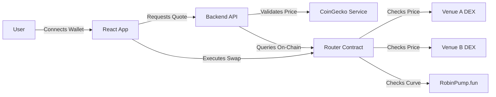

# BaseFlow-Router

> Smart DEX aggregator that automatically finds the best swap routes on Base network.

[](https://opensource.org/licenses/ISC)
[](https://base.org)

## Description

**BaseFlow-Router** is a smart liquidity aggregator built specifically for the Base ecosystem. It solves the problem of fragmented liquidity by automatically scanning multiple venues—including standard AMMs and the **RobinPump.fun** bonding curve—to find and execute the most profitable trade route for any token pair. Designed for traders who want to maximize returns without manually comparing prices across platforms, it offers superior execution for both established assets and early-stage bonding curve tokens.

## Table of Contents

- [Features](#features)
- [Tech Stack](#tech-stack)
- [Architecture Overview](#architecture-overview)
- [Installation](#installation)
- [Usage](#usage)
- [Configuration](#configuration)
- [API Reference](#api-reference)
- [Tests](#tests)
- [Roadmap](#roadmap)
- [Contributing](#contributing)
- [License](#license)
- [Contact](#contact)

## Features

- **Smart Routing**: Automatically routes trades to the venue with the best price (Standard DEX vs Bonding Curve).
- **Bonding Curve Integration**: Exclusive support for **RobinPump.fun** for superior early-token pricing.
- **Real-time Aggregation**: Queries multiple venues in parallel for instant quotes.
- **Safety First**: Built-in specialized slippage protection and CoinGecko price validation.
- **Mock Mode**: Fully functional zero-cost simulation mode for UI/UX testing and demos.
- **One-Click Execution**: Seamlessly execute the optimal trade directly from the interface.

## Tech Stack

- **Frontend**: React, TypeScript, Vite, TailwindCSS
- **Backend**: Node.js, Express, Ethers.js
- **Blockchain**: Solidity, Hardhat, Base Sepolia
- **Services**: CoinGecko API for price validation

## Architecture Overview


More diagrams and architecture are available in ARCHITECTURE.md: https://github.com/MasteraSnackin/BaseFlow-Router/blob/master/ARCHITECTURE.md

The system consists of a React Frontend for user interaction, a Node.js Backend that aggregates quotes and validates prices against CoinGecko, and a set of Smart Contracts on Base Sepolia. The Router contract is the core on-chain component, responsible for querying connected venues (VenueA, VenueB, RobinPump.fun) and executing the trade through the most profitable path.


## Installation

Clone the repository:

```bash
git clone https://github.com/MasteraSnackin/BaseFlow-Router.git
cd BaseFlow-Router
```

Install dependencies:

```bash
# Root dependencies
npm install

# Backend dependencies
cd backend
npm install

# Frontend dependencies
cd ../frontend
npm install
cd ..
```

Compile Smart Contracts:

```bash
npx hardhat compile
```

## Usage

You can run the full stack locally using the provided convenience scripts.

Start the Backend API:

```bash
npm run backend
# Runs on http://localhost:4000
```

Start the Frontend:

```bash
npm run frontend
# Runs on http://localhost:5173
```

Deploy Contracts (Optional for Mock Mode): If you want to run against a real testnet, deploy the contracts first:

```bash
npx hardhat run scripts/deploy.js --network baseSepolia
```

## Configuration

The project uses .env files for configuration.

Backend (backend/.env):

```bash
PORT=4000
BASE_SEPOLIA_RPC_URL=https://sepolia.base.org
# Router contract address (use mock address for simulation)
ROUTER_ADDRESS=0x1234567890123456789012345678901234567890
```

Root (.env) for deployment:

```bash
BASE_SEPOLIA_RPC_URL=https://sepolia.base.org
PRIVATE_KEY=your_private_key_here
```

## API Reference

The backend exposes a simple REST API for quoting.

**Get Quote**

```text
POST /quote
```

Request Body:

```json
{
  "chainId": 84532,
  "tokenIn": "0x...",
  "tokenOut": "0x...",
  "amountIn": "1000000000000000000",
  "slippageBps": 50
}
```

Response:

```json
{
  "smartVenue": "ROBINPUMP_FUN",
  "smartAmountOut": "1050000000000000000",
  "improvementBps": 500,
  "pumpFunInfo": {
    "bondingProgress": 45,
    "currentPrice": "0.00003"
  }
}
```

## Tests

Run the smart contract test suite using Hardhat:

```bash
npx hardhat test
```

## Roadmap

- Integrate additional Base DEXs (Aerodrome, SushiSwap).
- Add support for multi-hop routing paths.
- Implement MEV protection for executed trades.
- Add portfolio tracking dashboard for user positions.

## Contributing

Contributions are welcome!

1. Fork the repository.
2. Create a feature branch (`git checkout -b feature/amazing-feature`).
3. Commit your changes (`git commit -m 'Add some amazing feature'`).
4. Push to the branch (`git push origin feature/amazing-feature`).
5. Open a Pull Request.

## License

Distributed under the ISC License. See LICENSE for more information.
